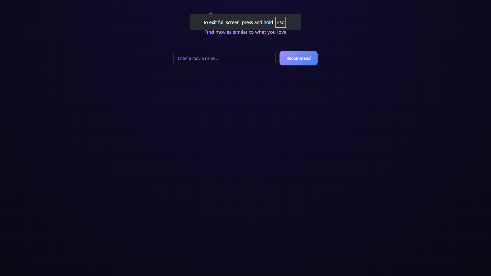
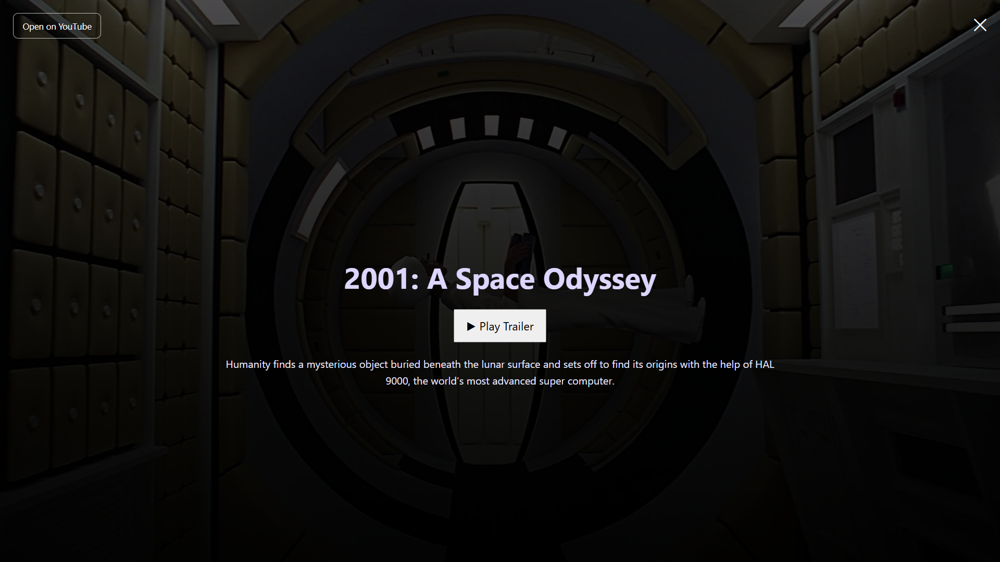

# 🎬 CineSense AI

CineSense AI is a full-stack, AI-powered movie recommendation web application that suggests movies based on content similarity and enriches results with real-time movie data such as posters, backdrops, descriptions, and trailers using the TMDB API.

This project combines **Machine Learning**, **Flask backend APIs**, and a **modern JavaScript frontend** to deliver a cinematic movie discovery experience.

---

## 📸 Screenshots

### Home Screen

### Movie Recommendations

### Movie Details & Trailer

## ✨ Features

- 🤖 AI-based movie recommendations (content-based filtering)
- 🧠 NLP with cosine similarity on movie metadata
- 🎥 Real-time posters, backdrops & trailers via TMDB API
- 🖥️ Cinematic fullscreen overlay UI
- 📜 Scrollable overlay for long descriptions
- ▶️ Embedded trailer playback with YouTube fallback
- 🔐 Secure API key handling using environment variables

---

## 🧠 Tech Stack

**Frontend**
- HTML
- CSS
- JavaScript

**Backend**
- Python
- Flask
- Flask-CORS
- Requests

**Machine Learning**
- Pandas
- NumPy
- Scikit-learn
- CountVectorizer
- Cosine Similarity

---

## 🏗️ Architecture Overview

- User
- ↓
- Frontend (HTML/CSS/JS)
- ↓ Fetch API
- Flask Backend
- ↓
- ML Recommendation Engine
- ↓
- TMDB API
- ↓
- Enriched movie data → Frontend UI

## 📌 Notes

- Trained ML model files (.pkl) are intentionally not committed to GitHub.

- Some YouTube trailers cannot be embedded due to restrictions.

## 👨‍💻 Author

- Utkarsh Kumar
- BTech CSE Student
- Interests: Web Development, Machine Learning, Full-Stack Projects